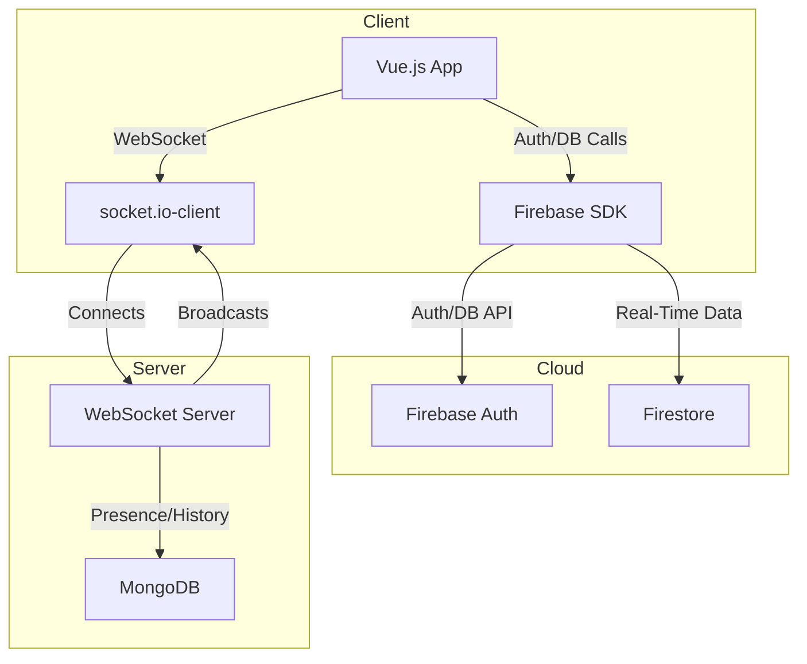
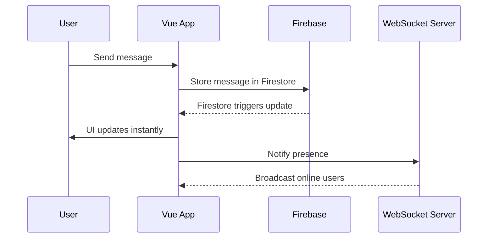

# 🟢 Real-Time Chat App

A dynamic, modern web-based chat application built with Vue.js, Firebase, and WebSockets. Enjoy instantaneous messaging, user presence, and robust group chat features—all in a beautiful, intuitive UI.

---

## 🚀 Features

- **Real-Time Messaging**: Instant group chat with live updates.
- **User Presence**: See who's online in real time.
- **Authentication**: Secure sign-in with Firebase Auth.
- **WebSocket Integration**: Lightning-fast updates and presence via socket.io.
- **Responsive UI**: Sleek, modern, and mobile-friendly.

---

## 🖼️ Architecture Overview



---

## 📦 Tech Stack

- **Frontend**: Vue.js 3, Vite, socket.io-client, Firebase
- **Backend**: Node.js, socket.io, MongoDB (for presence/history)
- **Cloud**: Firebase (Auth, Firestore)

---

## 🛠️ Setup & Installation

1. **Clone the repo:**
   ```sh
   git clone https://github.com/jellyfishing2346/chat-app.git
   cd chat-app
   ```
2. **Install dependencies:**
   ```sh
   cd client/chat-vue-app
   npm install --legacy-peer-deps
   ```
3. **Configure Firebase:**
   - Copy your Firebase config into `src/firebase.js`.
4. **Start the app:**
   ```sh
   npm run dev
   ```
5. **(Optional) Start WebSocket server:**
   - See `/server` for Node.js socket.io server setup.

---

## 🔑 Firebase Setup

1. Go to [Firebase Console](https://console.firebase.google.com/)
2. Create a project & web app
3. Copy your config to `src/firebase.js`:
   ```js
   const firebaseConfig = {
     apiKey: '...'
     // ...
   }
   ```
4. Enable **Authentication** and **Firestore** in Firebase Console.

---

## 💬 How It Works

### 1. User Authentication
- Users sign in via Firebase Auth.
- Auth state is synced across the app.

### 2. Real-Time Messaging
- Messages are stored in Firestore.
- Vue app listens for changes and updates instantly.

### 3. User Presence
- On login, client connects to WebSocket server.
- Presence is tracked and broadcast to all clients.

### 4. Group Chat
- All users in the same room see the same messages and presence list.

---

## 🖌️ UI Preview


---

## 📊 Sequence Diagram



---

## 📁 Project Structure

```
chat-app/
├── client/
│   └── chat-vue-app/
│       ├── src/
│       │   ├── components/
│       │   │   └── ChatRoom.vue
│       │   ├── firebase.js
│       │   └── socket.js
│       └── ...
├── server/
│   └── ... (WebSocket server)
└── README.md
```

---

## 🧩 Extending the App

- Add private messaging
- Emoji/sticker support
- File uploads
- Push notifications
- Theming/dark mode

---

## 🤝 Contributing

Pull requests are welcome! For major changes, open an issue first to discuss what you’d like to change.

---

## 📄 License

MIT

---

## ✨ Credits

- [Vue.js](https://vuejs.org/)
- [Firebase](https://firebase.google.com/)
- [Socket.io](https://socket.io/)
- [Vite](https://vitejs.dev/)

---

> Crafted with 💚 by Faizan Khan
